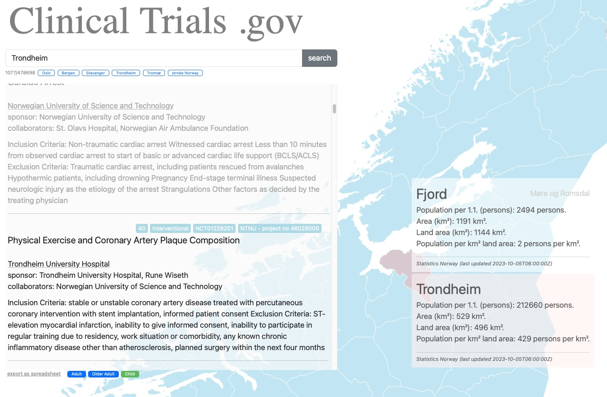

# A Map of Norway

This project demonstrates how to read and display a simple map of Norway.

Demo website with access to SSB and ClinicalTrials.org is [here](https://haukebartsch.github.io/map-of-norway/).

### Filter

Based on the age suggestion (child, adult, older adult) in the inclusion criteria the user can filter out studies.

